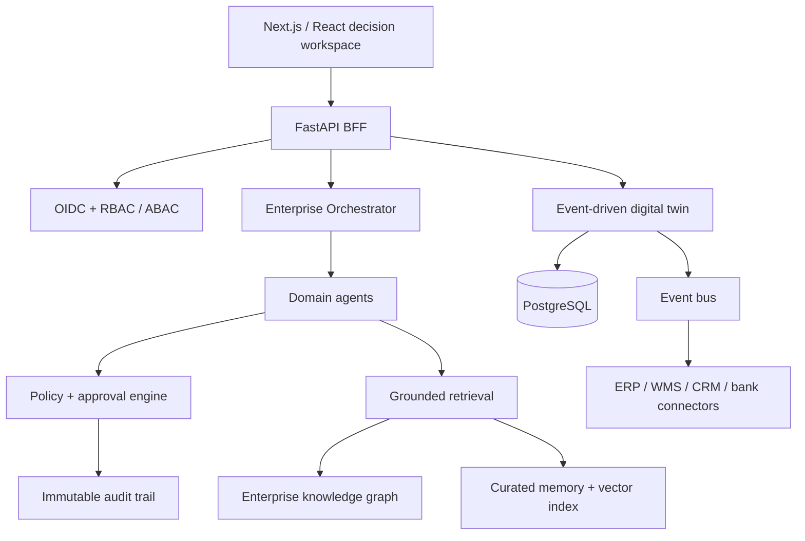

# CortexOS architecture and enterprise constraint baseline

## Public reference-data note

The accompanying demo uses Mahindra & Mahindra Limited’s Integrated Annual Report FY2025–26 as a public reference source. It contains reported performance highlights (including consolidated income from operations of ₹1,98,639 crore and PAT of ₹17,099 crore), risk disclosures, and stated Digital & AI themes. It is not connected to Mahindra systems and must not be interpreted as a live operational dashboard, internal forecast, or company recommendation. Source: https://www.mahindra.com/annual-report-FY2026/26/ (report pages 10, 38 and 50).

## Product boundary

CortexOS is an intelligence and orchestration layer that connects to existing systems of record. It does not replace a general ledger, bank, HRIS, MES, or tax authority in the MVP. The bounded vertical is procure-to-pay and working-capital intelligence, with cross-domain visibility from finance, procurement, inventory, and quality.

## Target architecture

## Design rules

1. No agent may manufacture enterprise facts. All factual claims carry source and freshness metadata.
2. Responses are typed as Fact, Insight, Prediction, or Recommendation. Predictions show confidence and assumptions.
3. High-impact actions are proposals only until an authorized human approves them through a policy-controlled workflow.
4. Agents are scoped by least privilege and operate on a tenant-isolated, purpose-limited data view.
5. Event history is append-only; derived views are reproducible from versioned events and models.

## Core data model

Tenant, legal_entity, user, role, permission, policy, approval_request, audit_event, connector, source_record, business_event, digital_twin_entity, relationship, evidence, memory, decision, recommendation, simulation_run, scenario_assumption, agent_run, model_version, invoice, purchase_order, goods_receipt, supplier, inventory_lot, warehouse, ledger_entry, cash_forecast.

All business records use tenant_id, legal_entity_id, source_system, source_record_id, event_time, ingest_time, version, provenance, and data_quality_status. Financial postings also require currency, fiscal calendar, accounting standard, and immutable journal linkage.

## API boundary

`POST /v1/questions` creates a grounded investigation; `GET /v1/questions/{id}` returns typed claims, evidence, confidence and audit id. `POST /v1/simulations` starts a versioned scenario run. `POST /v1/approvals/{id}/decisions` records an authorized human decision. `GET /v1/twin/metrics` returns governed KPI views. Connector webhooks publish signed events to the ingest gateway; no client writes directly to the ledger or audit store.

## Constraint register

| # | Constraint | Why / impact | Architecture & recommended solution | Priority |
|---|---|---|---|---|
| 1 | Functional scope | A full ERP cannot be safely built as one product increment. | Start with P2P intelligence; use bounded workflows and connectors. | MVP |
| 2 | Technical consistency | Distributed source systems disagree and change. | Canonical event envelope, idempotency keys, schema registry, reconciliation jobs. | MVP |
| 3 | AI grounding | LLMs can hallucinate or confuse data with inference. | Retrieval only from governed evidence; typed outputs, citations, refusal when evidence is insufficient. | MVP |
| 4 | Security | Financial and identity data are high-value targets. | OIDC, MFA, least privilege, KMS encryption, secrets vault, WAF, audit logging. | Production |
| 5 | Privacy | HR and customer data need purpose limits and minimization. | Field-level classification, masking, consent/purpose policy, deletion workflow. | Production |
| 6 | Compliance | Tax, retention, data residency and audit obligations vary. | Jurisdiction policy packs, configurable retention, evidence retention, regional tenancy. | Enterprise |
| 7 | Financial accuracy | Incorrect advice can cause loss or misstated accounts. | Ledger remains system of record; reconciliation, double-entry invariants, approval gates. | MVP |
| 8 | Legal authority | AI cannot bind contracts or payments without authorized signers. | Delegation-of-authority rules, e-sign integration, non-repudiation records. | Production |
| 9 | Infrastructure | Multi-region systems require controlled failover. | Stateless services, regional data planes, IaC, health checks, tested failover. | Enterprise |
| 10 | Performance | Executive interaction must feel immediate. | Precompute KPIs, cache governed read models, async long-running simulations. | MVP |
| 11 | Scalability | Event and agent volume can grow independently. | Partition by tenant/time, event streaming, worker queues, rate quotas. | Production |
| 12 | Reliability | Connectors and models fail in partial ways. | Retries with idempotency, DLQ, circuit breakers, graceful stale-data states. | Production |
| 13 | Availability | Critical approval work needs a clear degradation mode. | Multi-AZ deployment, read-only fallbacks, RTO/RPO targets, status communication. | Enterprise |
| 14 | Data integrity | Duplicate or reordered events distort the twin. | Immutable event store, versioning, dedupe, reconciliation and source precedence. | MVP |
| 15 | Data quality | Forecasts inherit source errors. | Quality scores, anomaly checks, lineage display and user correction workflow. | MVP |
| 16 | Integration | Enterprises will retain legacy systems. | Connector SDK, OAuth/service accounts, CDC/webhooks, mapping UI and sandbox. | Production |
| 17 | Multi-tenancy | A cross-tenant leak is catastrophic. | Tenant key on every table/query/cache/vector namespace; isolation tests. | MVP |
| 18 | Governance | Policies must be reviewable and change-controlled. | Versioned policies, SoD checks, owner/expiry metadata, governance workflow. | Production |
| 19 | Explainability | Users need to challenge decisions. | Evidence trail, claim type, uncertainty, assumptions and model version on every decision. | MVP |
| 20 | Human approval | High-risk actions need accountability. | Risk tiers, approval matrix, dual control, immutable decision log. | MVP |
| 21 | Agent coordination | Agents can conflict or loop. | Orchestrator state machine, budgets, tool allowlists, conflict resolver, kill switch. | Production |
| 22 | Memory | Raw data retention is costly and risky. | Separate raw records from curated, provenance-linked summaries; TTL and review. | MVP |
| 23 | Storage | Large historical operational data has lifecycle cost. | Hot PostgreSQL, object archive, vector index for curated knowledge, tiered retention. | Production |
| 24 | Cost | Agentic reasoning can become unbounded. | Retrieval caps, model routing, token budgets, batch analysis, per-tenant cost observability. | MVP |
| 25 | UX | Enterprise users need speed and trust, not a generic chat. | Decision workspace with evidence, approval state and progressive disclosure. | MVP |
| 26 | Offline | Financial commitments cannot be silently made offline. | Read-only cached context; queue drafts only; require revalidation before execution. | Production |
| 27 | Internationalization | Currency, dates, language and fiscal rules vary. | Locale-aware rendering, ISO currencies, fiscal calendars, translatable policy packs. | Production |
| 28 | Disaster recovery | Audit and business continuity data must survive regional failure. | Immutable backups, cross-region replication, recovery drills, tested restore. | Enterprise |
| 29 | Business continuity | AI outage must not stop operations. | Human-owned fallback workflows, source-system continuity, documented manual procedures. | Production |
| 30 | Edge cases | Missing evidence, conflicting systems and policy changes are normal. | Explicit unknown state, conflict queues, simulation sensitivity ranges, policy effective dates. | MVP |

## Self-critique and redesign actions

The largest single point of failure is the orchestrator, so it must be stateless and replayable from a durable run log. The biggest security risk is connector credential compromise; isolate credentials in a vault, use short-lived tokens, and enforce egress allowlists. The biggest privacy risk is indiscriminate memory retention; require data classification and memory expiry. The largest AI risk is presenting causal certainty from correlation; distinguish evidence, inference, and forecast, show confidence, and require human approval. The main adoption risk is asking customers to migrate; lead as an intelligence overlay with narrow, high-value connectors.

## Enterprise readiness score: prototype milestone

| Area | Score / 100 | Next improvement |
|---|---:|---|
| Security | 38 | Implement OIDC, KMS, RBAC/ABAC and penetration testing. |
| Privacy | 32 | Add classification, minimization, regional residency and DSAR workflows. |
| AI reliability | 45 | Add retrieval evaluation, claim validators and model monitoring. |
| Scalability | 35 | Introduce event bus, partitioning and load testing. |
| Maintainability | 40 | Split UI into typed Next.js components and define API contracts. |
| Performance | 52 | Add read models, caching and async simulation jobs. |
| Enterprise readiness | 31 | Build the controls above and obtain assurance evidence. |
| Developer experience | 43 | Add monorepo, CI, test fixtures and local connector emulator. |
| Financial accuracy | 48 | Reconcile to source ledgers and enforce posting invariants. |
| Compliance | 25 | Implement jurisdiction controls and an audit evidence program. |
| Automation | 44 | Add policy-limited workflow execution and approval routing. |
| User experience | 72 | Validate with finance leaders and add role-specific workspaces. |
| Observability | 30 | Add traces, SLOs, cost metrics and decision/audit telemetry. |
| Resilience | 28 | Define RTO/RPO, backup/restore and chaos testing. |
| Explainability | 68 | Persist source spans, assumptions and counterfactuals per answer. |
